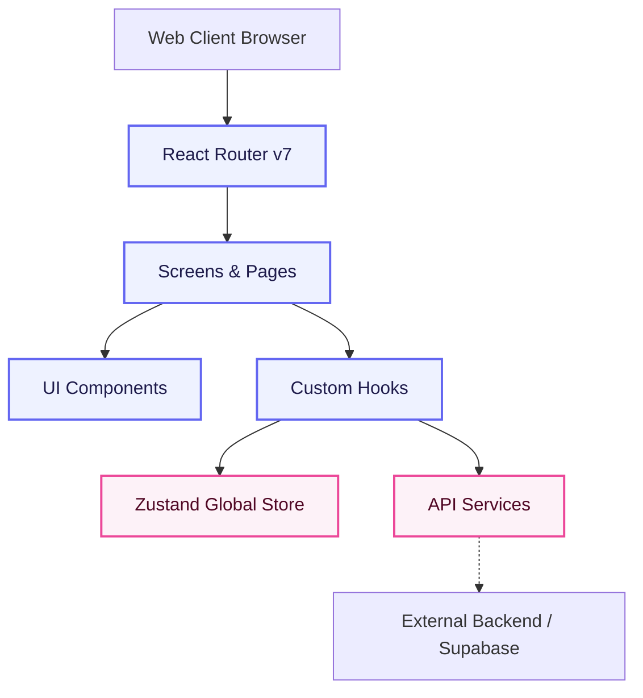

# GrowBoard

A premium Stream Deck-style productivity tool management dashboard. GrowBoard lets users configure and manage automated tasks, tracking the progress of projects with dynamic, highly-responsive interfaces.

## Architectural Diagram



## Table of Contents

- [Directory Structure](#directory-structure)
- [Tech Stack & Dependencies](#tech-stack--dependencies)
- [How It Works](#how-it-works)
- [Getting Started & Installation](#getting-started--installation)
- [Testing Guide](#testing-guide)

## Directory Structure

```
growboard/
├── public/                 # Static assets and index.html
├── src/                    # Source code directory
│   ├── assets/             # Reusable SVG icons, images, fonts
│   ├── components/         # Reusable Chakra UI-based UI components
│   ├── hooks/              # Custom React hooks for shared logic
│   ├── localization/       # i18next translation configurations
│   ├── provider/           # React Context providers
│   ├── router/             # React Router v7 configuration
│   ├── screens/            # Top-level page views
│   ├── services/           # API layer and networking services
│   ├── store/              # Zustand global state slices
│   ├── testUtils/          # Test helpers, mocks, and setup
│   ├── util/               # Shared helper functions
│   ├── index.tsx           # React DOM entry point
│   └── App.tsx             # App root component
├── scripts/                # Task-specific helper scripts
├── craco.config.js         # CRA Configuration Override
├── package.json            # Project dependencies and scripts
└── yarn.lock               # Yarn 4 lockfile
```

## Tech Stack & Dependencies

| Package                 | Version | Purpose                             |
| :---------------------- | :------ | :---------------------------------- |
| `react`                 | 18.2.0  | Core UI Library                     |
| `react-router-dom`      | 6.21.3  | Client-side routing and navigation  |
| `@chakra-ui/react`      | 2.8.2   | Component styling and design system |
| `zustand`               | 4.5.2   | Global state management             |
| `@tanstack/react-query` | 5.66.0  | Server-state synchronization        |
| `@craco/craco`          | 7.1.0   | Webpack configuration overrides     |

## How It Works

1. **Initialization**: The application bootstraps from `src/index.tsx`, injecting global React Context providers (Chakra Theme, i18next Localization, Supabase Auth).
2. **Routing**: `react-router-dom` orchestrates URL-to-Component mapping through `src/router/`, securely wrapping authenticated paths.
3. **State Management**: Complex UI states and configuration bindings are managed synchronously via Zustand, while asynchronous data interactions (fetching/mutating) pass through React Query.
4. **Services Layer**: Network operations are encapsulated in `src/services/` utilizing `axios` or Supabase SDK to communicate with backend APIs.

## Getting Started & Installation

### Prerequisites

- Node.js (v18+ recommended)
- Yarn package manager

### Commands

To run the application locally:

```bash
yarn install
yarn start
```

For building a production bundle:

```bash
yarn build
```

## Testing Guide

- **Unit/Integration Tests**: Run `yarn test` to execute the Jest suite using React Testing Library.
- **Coverage**: Run `yarn test:cov` to generate code coverage metrics.
- **E2E Testing**: Run `yarn cy:open` to launch the Cypress testing dashboard.
